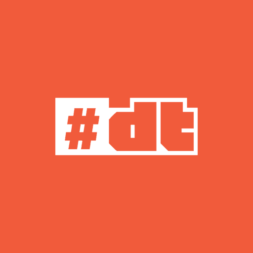
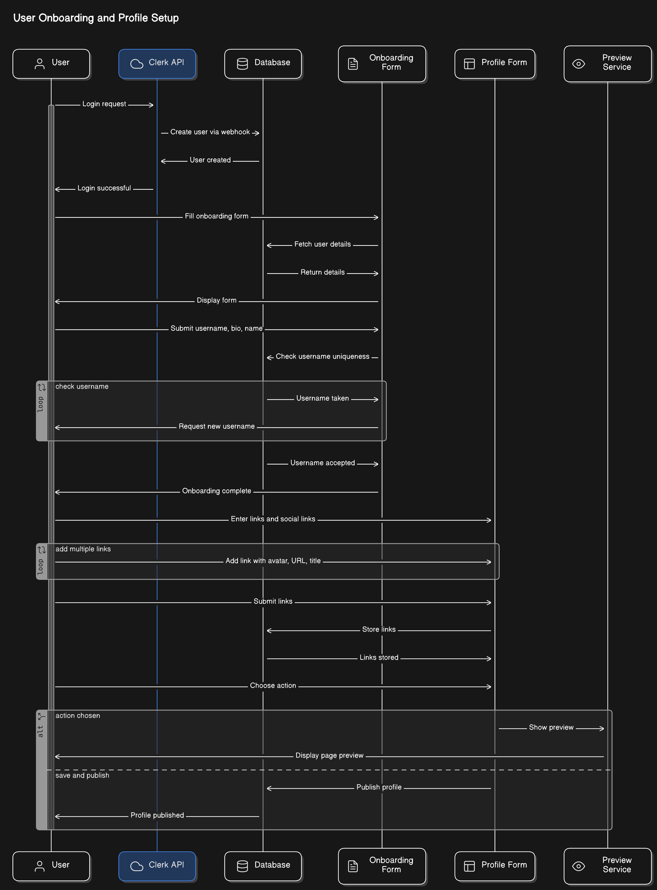

<a href="https://github.com/rohitt-gupta/dominate-links" title="Dominate Links">

  

<h1 align="center">Dominate Links</h1>
</a>

 

<b>Dominate Links</b> is a web application that allows users to create personalized pages containing multiple links.

---

## Table of Contents

-   [Overview](#overview) 🚀
-   [Features](#features) ✨
-   [Technologies](#technologies) 🛠
-   [Flowchart](#flowchart) 📦
-   [Contributing](#contributing) 🤝
-   [License](#license) 📄
-   [Contact](#contact) 📧
-   [Acknowledgments](#acknowledgments) 🙏

---

## Overview 🚀

Dominate Links is a web application that allows users to create personalized pages containing multiple links. It serves as a centralized hub for users to share various links, such as social media profiles, websites, portfolios, and more. With Dominate Links, users can create a single, easy-to-remember link to share with their audience, simplifying the process of sharing multiple links across different platforms.

## Features ✨

- **👤 Personalized Pages**: Each user is assigned a personalized page based on their chosen username, resulting in a unique custom URL for easy access.

- **🔍 Preview Links**: Users can preview how their links will be displayed on a mobile screen.

- **🚀 Easy Sharing**: Users can easily share their personalized pages with others through a single link.

- **🎨 Customization Options**: Users have the option to customize the appearance of their pages with themes and colors.

- **📊 Analytics**: Provides insights into link clicks and user interactions through built-in analytics.

- **📱 Responsive Design**: Responsive design ensures optimal user experience across different devices and screen sizes.

## Technologies 🛠

### Prerequisites

Ensure you have the following prerequisites installed before getting started:

- [Node.js](https://nodejs.org/) (`18.0v+`)
- [pnpm](https://pnpm.io/)
- [Git](https://git-scm.com/)
- A [Clerk](https://clerk.com/) account for authentication and user management

### Tech Stack

- **Frontend and Backend** - [Next.js](https://nextjs.org/)
- **CSS Framework** - [Tailwind CSS](https://tailwindcss.com/)
- **UI Component Library** - [Shadcn](https://shadcn.dev/)
- **Authentication** - [Clerk](https://clerk.dev/)
- **ORM** - [Prisma](https://www.prisma.io/)
- **Database** - [PostgreSQL](https://www.postgresql.org/)

## Flowchart 📦

### Module Level flow

### User Actions flow

## Contributing 🤝

We are excited to have you contribute to the **Dominate Links** project! Before contributing, please read the [Code of Conduct](CODE_OF_CONDUCT.md) to ensure a positive and inclusive environment for the project.

> Join the **Dominate X Club** [Discord server](https://discord.gg/ccnBJXSKt7) to connect with other contributors and stay updated on the project's development.
> 🔗 [discord.gg/ccnBJXSKt7](https://discord.gg/ccnBJXSKt7)

### **How to Contribute**

To contribute to **Dominate Links**, check out the [Contributing Guidelines](CONTRIBUTING.md).

And if you like the project, but just don't have time to contribute, that's fine. There are other easy ways to support the project and show your appreciation, which we would also be very happy about:
- Star the project
- Tweet about it and make sure to mention [@dominateXclub](https://x.com/dominateXclub) on **X**.
- Refer this project in your project's readme.
- Mention the project at local meetups and tell your friends/colleagues.

## License 📄

This project is licensed under the **MIT License** 🔐 - see the [LICENSE](LICENSE)  file for details.

## Contact 📧

If you have any questions or need support, you can reach out to us through the following channels:

## Acknowledgments 🙏

We would like to express our gratitude to the following contributors for their valuable contributions to Dominate Links:

---

	Developed with ❤️ by The <a href="https://x.com/i/communities/1769406952939864575"><strong>Dominate X Club</strong></a>

